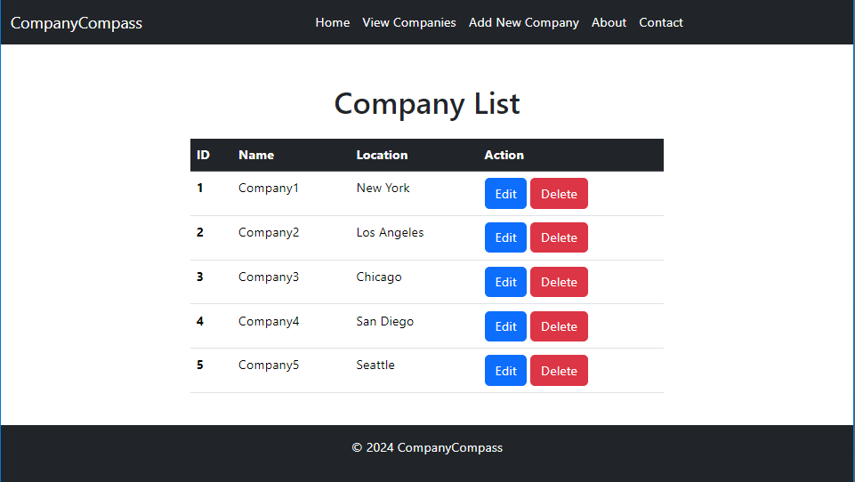

# CompanyCompass
## Table of Contents
- [Introduction](#introduction)
- [Features](#features)
- [Technologies Used](#technologies-used)
- [Usage](#usage)
- [References](#references)
- [Contributing](#contributing)

## Introduction
CompanyCompass is an example web application developed using Java with a Spring Boot framework,
offering a robust and scalable solution for managing company information.
The frontend is built using Thymeleaf and Bootstrap, providing a responsive and user-friendly interface.
CompanyCompass allows users to view, add for privileged users to edit, and delete company details,
providing a centralized platform for easy access and management of company data.

## Features
Spring boot web with thymeleaf, jpa, and test. Flyway database with MySQL to store the data. 

## Technologies Used
- **Languages**: Java, JavaScript and CSS
- **Framework**: Spring Boot
- **Database**: MySQL
- **Others**: Thymeleaf and Flyway

## Usage
#### Ensure all maven modules are installed and the project is fully indexed before executing.
#### Use the latest JDK version (JDK 22) for the project.

To execute an example application CompanyCompass, you need to run a java file named Application.java
(Path location from a source project: **com/example/companycompass/Application.java**)

## Screenshots
### CompanyCompass Homepage

### CompanyCompass View Companies Page

## Contributing
For contributing or using the software, please contact me to make a change.

## References
* [Maven](https://maven.apache.org/)
* [Maven Repository](https://mvnrepository.com/)
* [Spring](https://spring.io/)
* [Flyway](https://flywaydb.org/)
* [Thymeleaf](https://www.thymeleaf.org/)
* [Docker](https://docs.docker.com/)
* [Bootstrap](https://getbootstrap.com/)
